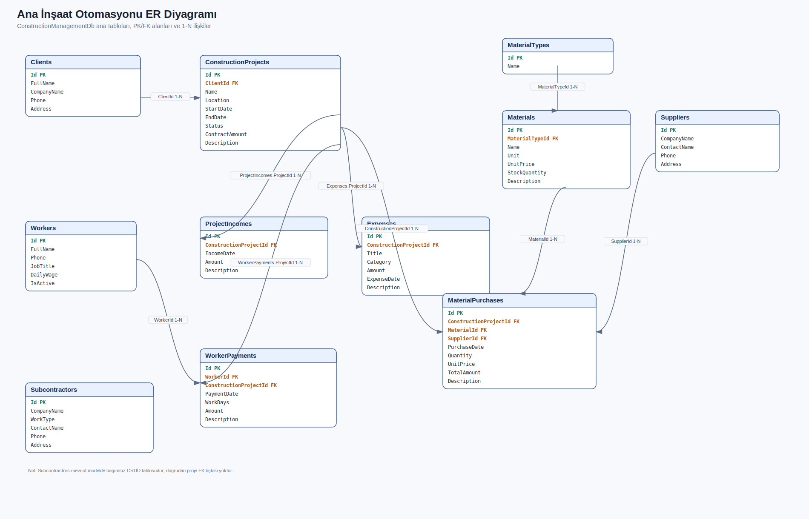
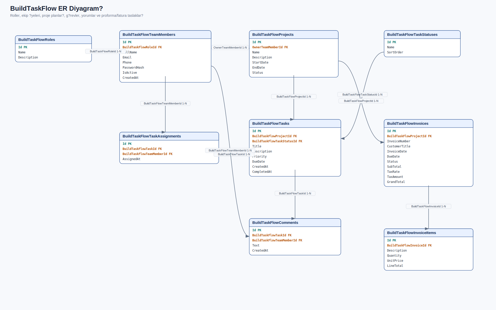

# Construction Company Site and Material Management System

A small ASP.NET Core Razor Pages web app for managing construction projects, site materials, workers, payments, income and expenses.

The app has two main parts:

- **Construction operations:** projects, clients, materials, suppliers, subcontractors, workers, purchases, income and expenses.
- **BuildTaskFlow:** a built-in task management area with roles, team members, tasks, comments and proforma/invoice draft records.

The interface supports **Turkish and English**. You can switch language from the `TR / EN` selector in the navbar.

## What It Does

This project helps a construction company keep daily site records in one place. The dashboard shows project counts, active projects, contract totals, project income, material purchase costs, worker payments, expenses and net profit/loss.

BuildTaskFlow adds a simple role-based workflow on top of the main system. Team members can sign in, see the screens allowed for their role, follow tasks and manage dated proforma/invoice draft records.

## Tech Stack

- ASP.NET Core Razor Pages
- C#
- Entity Framework Core
- SQL Server Express / LocalDB
- Bootstrap
- Cookie-based login
- Role-based authorization
- Code-first migrations
- Turkish / English UI support

## Main Tables

- `ConstructionProjects`: construction projects/sites
- `Clients`: employers and client companies
- `MaterialTypes`: material categories
- `Materials`: material records, units, prices and stock quantities
- `Suppliers`: supplier companies
- `MaterialPurchases`: project-based material purchases
- `Subcontractors`: subcontractor companies
- `Workers`: workers and daily wages
- `WorkerPayments`: project-based worker payments
- `ProjectIncomes`: project income records
- `Expenses`: site expenses

## BuildTaskFlow Tables

- `BuildTaskFlowRoles`: user roles
- `BuildTaskFlowTeamMembers`: login-enabled team members
- `BuildTaskFlowProjects`: task management projects
- `BuildTaskFlowTaskStatuses`: task status list
- `BuildTaskFlowTasks`: task records
- `BuildTaskFlowTaskAssignments`: assigned team members
- `BuildTaskFlowComments`: task comments
- `BuildTaskFlowInvoices`: proforma/invoice draft headers
- `BuildTaskFlowInvoiceItems`: proforma/invoice draft line items

## ER Diagrams

### Construction Management ER Diagram



### BuildTaskFlow ER Diagram



## Features

- Login screen with role-based access
- Turkish / English language switcher
- Dashboard for financial and operational totals
- CRUD pages for projects, clients, materials, material types, suppliers, subcontractors, workers and expenses
- Material purchase flow that increases stock quantity
- Material purchase total calculated from quantity x unit price
- Worker payment amount calculated from work days x daily wage
- Project income and expense tracking
- Read-only SQL query screen for `SELECT` queries
- BuildTaskFlow tasks, task comments and team member tracking
- BuildTaskFlow Gantt screen with project/task dates, team member workload and completion percentages
- Dated, numbered and itemized proforma/invoice draft screen

## Roles

- **Admin:** can access and manage all screens.
- **Project Manager:** manages projects, clients, subcontractors, tasks and SQL queries.
- **Site Chief:** follows projects, workers and site tasks.
- **Material Manager:** manages materials, material types, suppliers, material purchases and tasks.
- **Accounting:** manages worker payments, project income, expenses and proforma/invoice drafts.
- **Viewer:** can view records but cannot create, edit or delete.

## Sample Accounts

All sample users use the same password:

```text
123456
```

Accounts:

- `admin@buildtaskflow.local` - Admin
- `proje@buildtaskflow.local` - Project Manager
- `santiyesefi@buildtaskflow.local` - Site Chief
- `depo@buildtaskflow.local` - Material Manager
- `muhasebe@buildtaskflow.local` - Accounting
- `goruntuleyici@buildtaskflow.local` - Viewer

## Setup

Open the project folder:

```bash
cd ConstructionManagementSystem
```

Restore packages:

```bash
dotnet restore
```

Restore local .NET tools:

```bash
dotnet tool restore
```

Create or update the database:

```bash
dotnet tool run dotnet-ef database update
```

If you have the EF Core CLI installed globally, this also works:

```bash
dotnet ef database update
```

Run the app:

```bash
dotnet run
```

Then open the localhost URL shown in the terminal.

## Database

The default connection string is in `appsettings.json`:

```json
"DefaultConnection": "Server=(localdb)\\MSSQLLocalDB;Database=ConstructionManagementDb;Trusted_Connection=True;MultipleActiveResultSets=true;TrustServerCertificate=True"
```

The app uses SQL Server LocalDB by default. On another computer, install the .NET SDK and SQL Server LocalDB or SQL Server Express. If you use SQL Server Express, update the `Server` value in the connection string.

## Seed Data

After the database update command, the app creates sample data for:

- Material types, materials, clients, suppliers, subcontractors and workers
- Active and completed construction projects
- Concrete, rebar and cement purchase records
- Worker payments, project income and site expenses
- BuildTaskFlow roles, sample users, projects, tasks, comments and a proforma draft

## Notes

- The app uses login and role-based access control.
- The proforma/invoice draft screen does not issue official invoices.
- There is no e-Invoice, e-Archive, tax system, government portal or accounting integration.
- There is no online payment integration.
- The SQL query screen only allows read-only `SELECT` queries.
